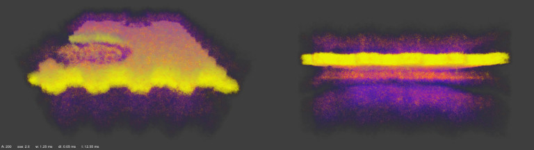
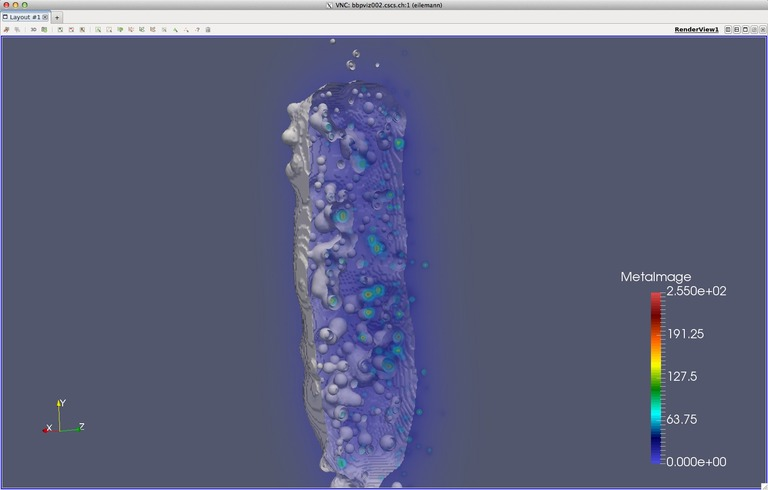

Fivox Documentation
===================

# Introduction

Fivox (Field Voxelization) is a library to generate volumetric images of
3d scalar fields (Local Field Potential, spike densities, voltage
sensitive dye), with loaders for the compartment, soma and spike reports
generated by the Neuron and NEST simulators used in the Blue Brain
Project. Fivox supports time animation. For more information see @ref
applications.

Fivox can be retrieved by cloning
the [source code](https://github.com/BlueBrain/Fivox).

The voxelize command line tool can be used to generate volumes for
ParaView or other volume rendering applications. When compiled with
Livre, launch Livre with one of the URIs used by the voxelize command line tool
as the volume parameter. The fivox data source will be loaded
automatically and selected through one of the volume URI schemes.

The sample-point command line tool can be used to extract the time series at a
specific 3D point. The output file can be then used as the input for the
plot2D.py python tool to generate a 2D graph showing the evolution of the data
over time.

To use the ImageSource programmatically, please refer to the @ref fivox
namespace documentation and voxelize command line tool.

## Features

Fivox provides the following major features:

* Converting compartment reports to volumetric LFP-like data
* Converting spike reports densities to volumetric data
* Converting compartment and surface area reports to volumetric data
* Time and animation support
* Extract the time series at a specific point

# Installation

Build Fivox from source:
~~~
git clone --recursive https://github.com/BlueBrain/Fivox
mkdir Fivox/Build
cd Fivox/Build
cmake -GNinja -DCLONE_SUBPROJECTS=ON ..
ninja
~~~

# Usage

All command line applications support the following parameters:

@snippet apps/commandLineApplication.h AppParameters
@snippet fivox/uriHandler.cpp VolumeParameters

The voxelize command line tool also supports:

@snippet apps/voxelize/voxelize.cpp VoxelizeParameters

The sample-point command line tool also supports:

@snippet apps/samplePoint/sample-point.cpp SamplePointParameters

# About

Fivox uses CMake to create a platform-specific build environment. The following
platforms and build environments are tested:

* Linux: Ubuntu 14.04, RHEL 6.6 (Makefile, x64)
* Mac OS X 10.9

The [API documentation](https://bluebrain.github.io/Fivox-0.7/index.html)
can be found on [bluebrain.github.io](https://bluebrain.github.io).

# Funding & Acknowledgment
 
The development of this software was supported by funding to the Blue Brain Project,
a research center of the École polytechnique fédérale de Lausanne (EPFL), from the
Swiss government’s ETH Board of the Swiss Federal Institutes of Technology.

This project has received funding from the European Union’s FP7-ICT programme
under Grant Agreement No. 604102 (Human Brain Project RUP).

This project has received funding from the European Union's Horizon 2020 Framework
Programme for Research and Innovation under the Specific Grant Agreement No. 720270
(Human Brain Project SGA1).

This project is based upon work supported by the King Abdullah University of Science
and Technology (KAUST) Office of Sponsored Research (OSR) under Award No. OSR-2017-CRG6-3438.

Copyright (c) 2021-2022 Blue Brain Project/EPFL
